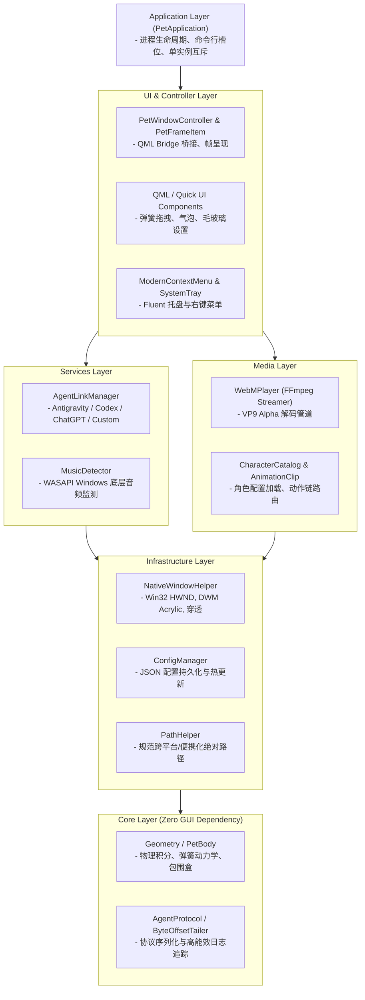

# Desktop Pet (桌面宠物)

<div align="center">


**新一代双引擎架构桌面萌宠：原生高性能 C++20 (Qt 6 / QML) 与敏捷 Python (PySide6) 完美融合**

[核心特性](#-核心特性) • [项目架构](#-项目架构) • [目录结构](#-目录结构) • [快速上手](#-快速上手) • [自定义角色与Agent](#-自定义角色与agent) • [开源协议](#-开源许可与协议)

</div>

---

## 📖 项目简介

**Desktop Pet** 是一款面向开发者与数字游民打造的沉浸式透明桌面宠物。无论是代码编写、音乐播放还是日常办公，它都能在屏幕一隅静静陪伴，感知你的工作律动与系统状态。

项目历经全面重构，现提供**双实现架构**：
1. **C++20 原生版 (`c++/`)**：采用现代化 C++20 + Qt 6 Quick / QML 构建，极低内存与 CPU 占用，原生 Win32 DWM 混合透明与高帧率 WebM 硬件渲染，适合极致追求性能的日常常驻。
2. **Python 版 (`python/`)**：基于 Python 3.12 + PySide6 打造，模块化松耦合架构，拥有 570+ 单元与集成测试，便于二次开发与算法实验。

---

## ✨ 核心特性

- **🎬 高清透明视频渲染引擎**：
  - 支持 **640×360 高清 WebM (VP9 + Alpha 通道)** 透明视频及经典 GIF。
  - 基于管道流与环形缓冲区实现逐帧硬件级纹理绘制，边缘平滑无锯齿，支持非矩形透明区域鼠标精准穿透。
  - 完备的状态机系统：待机呼吸、随机交互动作、转向游走、拖拽挣扎、物理下落自然衔接。

- **🎵 Windows WASAPI 音乐节奏响应**：
  - 深入 Windows 底层音频子系统（WASAPI），监听活跃音频会话（网易云、QQ音乐、Spotify、浏览器等）。
  - 当检测到扬声器放歌且能量高于阈值时，桌宠自动切换为**律动跳舞/听歌动作**，并在音乐停止后平滑回归待机。

- **🤖 多 AI Agent 深度联动 (Multi-Agent Link)**：
  - 原生联动主流 AI 工具与环境：**Google Antigravity IDE**、**ChatGPT / OpenAI Codex**、**Cursor** 以及用户自定义 Agent。
  - 基于高能效增量流式日志追踪（`ByteOffsetTailer`），无感知捕捉 Agent 的**思考中、读写文件、执行终端命令、运行测试、任务完成**等全生命周期状态。
  - 实时映射为生动的桌宠表情动作与对话气泡，无需右下角弹窗打扰。

- **🪶 真实物理动力学与触感交互**：
  - **弹簧阻尼拖拽**：鼠标抓起时带有拟真物理拉扯反馈，松开后根据速度惯性抛投并受重力回落。
  - **屏幕自适应**：智能识别主副屏工作区，底部自适应吸附与边缘软着陆。
  - **多实例避让与弹性碰撞**：支持开辟多个独立槽位（`--slot <n>`），各实例通过 IPC 实现弹性刚体碰撞互弹。

- **🪟 Windows 11 Fluent 现代美学**：
  - 现代化毛玻璃亚克力右键菜单，支持多级扩展、音效切换与动态图标。
  - 纯原生 QML 打造的卡片式设置面板，支持角色即时切换、缩放滑动、透明度微调、开机自启等。

---

## 🏛️ 项目架构

项目遵循严格的**分层解耦领域驱动架构 (Clean Layered Architecture)**，C++ 与 Python 两套技术栈保持一致的分层契约：



### 核心模块职责说明

| 分层 (Layer) | C++ 模块路径 (`c++/src/`) | Python 模块路径 (`python/pet/`) | 核心职责说明 |
| :--- | :--- | :--- | :--- |
| **Core** | `core/` | `core/` | 零 GUI 依赖的底层纯算法：物理动力学（`PetBody`）、碰撞几何模型（`Geometry`）、Agent 通信协议契约（`AgentProtocol`）与字节级文件尾随器（`ByteOffsetTailer`）。 |
| **Infrastructure** | `infrastructure/` | `infrastructure/` | 底层操作系统设施：Win32 API 原生窗口穿透与 DWM 样式（`NativeWindowHelper`）、JSON 格式持久化配置（`ConfigManager`）、应用便携路径换算（`PathHelper`）。 |
| **Media** | `media/` | `media/` | 动画资产与媒体解析：FFmpeg 透明 WebM 视频管道流（`WebMPlayer`）、角色元数据加载与动作链解析（`CharacterCatalog`）、系统音频会话监测（`MusicDetector`）。 |
| **Services** | `services/` | `services/` | 外部生态与业务监控：多 Agent 状态聚合器（`AgentLinkManager`）、Antigravity 监控、Codex 监视器、版本更新与系统通知。 |
| **UI** | `ui/`, `qml/` | `ui/` | 界面呈现与交互控制器：`PetWindowController`（QML 桥接中枢）、QML 视图与组件（`MainPetWindow.qml`、`SpeechBubble.qml`、`ModernSettingsView.qml`）、亚克力右键菜单。 |
| **Application** | `application/`, `main.cpp` | `application/`, `__main__.py` | 应用引导与生命周期管理：单实例互斥检测、命令行参数解析、全局事件过滤与优雅退出。 |

---

## 📁 目录结构

```text
desktop-pet/
├── c++/                             # 【C++20 / Qt 6 原生实现】
│   ├── assets/                      # 嵌入式程序图标、资源与素材
│   ├── qml/                         # Qt Quick / QML 界面声明（设置面板、气泡、主窗）
│   ├── src/                         # C++ 分层源代码 (core, infrastructure, media, services, ui, application)
│   ├── tests/                       # C++ CTest / QTest 自动化单元测试集
│   ├── build_and_package.ps1        # MSYS2 + MinGW64 一键编译与便携化打包脚本
│   ├── CMakeLists.txt               # CMake 构建工程描述文件
│   └── run.bat                      # 本地编译产物便捷启动脚本
│
├── python/                          # 【Python 3.12 / PySide6 实现】
│   ├── assets/                      # 角色动画素材包 (characters/)、音效包、图标
│   ├── packaging/                   # Inno Setup 安装包与 PyInstaller 配置文件
│   ├── pet/                         # Python 模块化分层源码 (镜像 C++ 架构)
│   ├── scripts/                     # 便携打包脚本 (build_onedir.ps1) 与开发辅助工具
│   ├── tests/                       # 全量自动化测试套件 (570+ pytest 用例)
│   ├── desktop-pet.spec             # PyInstaller 打包规格文件
│   ├── requirements.txt             # 运行依赖清单 (PySide6, Pillow, imageio-ffmpeg)
│   └── run.bat                      # Python 版本一键启动脚本
│
├── AI/                              # AI 产出与工程治理专用目录（详见 En-SKILL.md）
├── .vscode/                         # VSCode 工作区推荐配置与调试任务
├── En-SKILL.md                      # 通用工程开发交付、环境工具链与 AI 产出规范
├── .gitignore                       # 严密构建过滤配置
├── LICENSE                          # CC BY-NC 4.0 许可证全文
└── README.md                        # 项目主文档
```

---

## 🚀 快速上手

### 选项 A：运行 C++20 原生版 (推荐性能常驻)

#### 1. 前置依赖
- **操作系统**：Windows 10 / 11 (x64)
- **编译工具链**：MSYS2 MinGW64 (GCC 13+ / G++ 13+)
- **构建工具**：CMake 3.20+ 与 Ninja
- **Qt 库**：Qt 6.8+ (含 Core, Gui, Quick, Qml, Widgets, Network, Sql, Concurrent)
- **FFmpeg**：系统已安装或放置 `ffmpeg.exe` 于系统 PATH

#### 2. 本地编译与测试
```powershell
# 1. 切换至 C++ 目录
cd c++

# 2. 配置 CMake (以 MinGW64 + Ninja 为例)
cmake -G "Ninja" -DCMAKE_BUILD_TYPE=Release -B build

# 3. 编译二进制
cmake --build build --config Release

# 4. 执行自动化单元测试
ctest --test-dir build --output-on-failure
```

#### 3. 自动化打包绿色便携版
项目提供了完全自动化的打包与依赖补全脚本：
```powershell
# 运行自动化打包（执行编译、调用 windeployqt、智能提取 MinGW 依赖 DLL、同步素材）
powershell -ExecutionPolicy Bypass -File build_and_package.ps1
```
完成后即可在 `c++/dist/desktop-pet/` 中获取立即可用的绿色免安装包。

---

### 选项 B：运行 Python 版 (便于二次开发)

#### 1. 前置准备
推荐使用 Python 3.10 ~ 3.12 虚拟环境：
```bash
# 1. 切换至 Python 目录
cd python

# 2. 安装核心运行依赖
pip install -r requirements.txt
```

#### 2. 启动桌宠
```bash
# 启动主桌宠
python -m pet

# 指定插槽号多开（实例间自动碰撞弹射）
python -m pet --slot 1
```

#### 3. 自动化测试
```bash
# 在 Windows 环境下运行全量无头测试
$env:QT_QPA_PLATFORM = "offscreen"
python -m pytest -q
```

#### 4. 打包为绿色 EXE
```powershell
# 打包生成 onedir 绿色目录及 zip 压缩包
powershell -ExecutionPolicy Bypass -File scripts\build_onedir.ps1
```

---

## 🎨 自定义角色与Agent

### 1. 添加自定义角色素材
无论 C++ 版还是 Python 版，角色素材均遵循通用目录标准。直接在 `assets/characters/` 目录下新建角色文件夹即可免编译生效：

```text
assets/characters/<角色标识>/
├── character.json                   # 角色配置文件（帧率、动作映射、台词库）
├── idle.webm                        # 待机透明动画 (VP9 + Alpha)
├── idle_2.webm                      # 随机待机动作
├── drag.webm                        # 被鼠标提起挣扎动作
├── fall.webm                        # 自由落体下落动作
├── walk.webm                        # 左右爬行/行走动作
└── music.webm                       # 听歌跳舞律动动作 (可选)
```

**`character.json` 样例片段**：
```json
{
  "id": "my_pet",
  "name": "我的桌宠",
  "scale": 1.0,
  "default_fps": 30,
  "actions": {
    "idle": { "file": "idle.webm", "loop": true },
    "walk": { "file": "walk.webm", "loop": true },
    "drag": { "file": "drag.webm", "loop": true },
    "fall": { "file": "fall.webm", "loop": false },
    "music": { "file": "music.webm", "loop": true }
  },
  "quotes": [
    "主人，今天也要加油敲代码哦！",
    "写完了吗？记得多喝水休息一下~"
  ]
}
```

### 2. 对接触发自定义 Agent 状态
桌宠内置标准 Agent 通信契约。任何外部程序只需按如下 JSON 结构向桌宠约定的日志或 IPC 管道输出状态：

```json
{
  "agent": "MyCustomAgent",
  "state": "thinking",
  "message": "正在分析当前代码架构...",
  "progress": 0.45,
  "timestamp": 1726618800
}
```
桌宠将自动解析并根据状态切换对应的工作中动画与气泡台词。

---

## 📜 开源许可与协议

本项目遵循 **[Creative Commons Attribution-NonCommercial 4.0 International (CC BY-NC 4.0)](LICENSE)** 知识共享许可协议开源。

### 核心条款简要说明：

| 权利与限制 | 授权状态 | 说明 |
| :--- | :---: | :--- |
| **共享与传播** | ✅ 允许 | 可以在任何媒介以任何形式复制、发行本作品的完整副本或部分内容。 |
| **改编与衍生** | ✅ 允许 | 可以修改、转换、基于本代码与架构进行二次创作和定制。 |
| **开源与署名** | ⚠️ 必需 | 您必须给出适当的署名，提供指向本许可证的链接，并标明是否对原作品进行了修改。 |
| **商业使用** | ❌ **严格禁止** | **不得将本软件、源码、衍生作品、编译产物或附带素材用于任何形式的商业营利用途**。包括但不限于：直接转售、付费下载、捆绑销售、商业广告推广、嵌入商业收费软件或提供商业增值服务。 |

> 如需查看法律条款正式全文，请阅读根目录下的 [LICENSE](LICENSE) 文件。

---

<div align="center">
  <b>如果本项目对您的日常桌面或开发陪伴有所帮助，欢迎点个 ⭐ Star 支持！</b>
</div>
